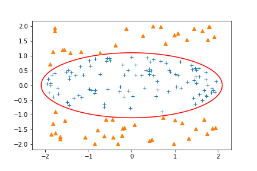
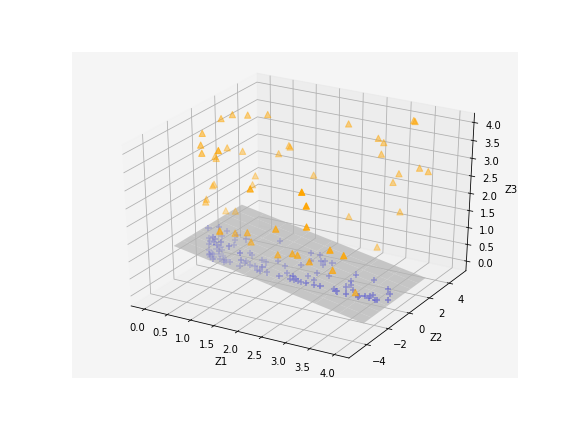
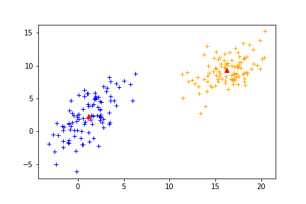
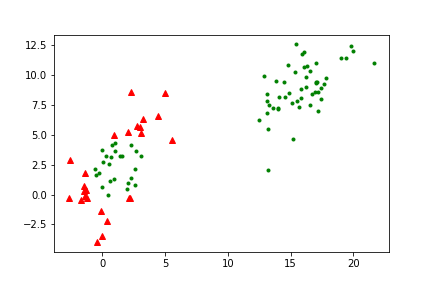

### 核方法(kernel method)(一)-Basic idea

> 在阅读迁移学习论文的时候，感觉自己kernel method方面不是很清楚，所以观看了李振轩老师的《kernel method》视频课程[B站链接](https://www.bilibili.com/video/BV1hW411C7ny?p=1)。用python实现了课程中提到的各种算法。[代码的github仓库](https://github.com/zhou317/kernel_method) 。个人水平有限，难免贻笑于大方之家。望大家多批评指正。

[TOC]

#### 1 基本想法

利用某个函数$\phi$,将不可线性分割的feature向量映射到可以线性分割的高维空间中。

例如下面的例子，本来需要椭圆曲线分开的二维平面的点，经过$\phi$映射到三维中，就可以用一个平面分割了。
$$
\phi : R^2 \rightarrow R^3 \\ (x_1,x_2) \rightarrow (z_1,z_2,z_3) = (x_1^2,\sqrt{2}x_1x_2,x_2^2)
$$

    
    

[这个例子的代码在此simple_example.ipynb](https://github.com/zhou317/kernel_method/tree/master/Basic)

对于这一个$\phi$,可以证明映射后的内积等于映射前的内积的平方。
$$
<\phi(x),\phi(x')> = (<x,x'>)^2
$$
我们将映射后的两个特征的内积叫做核函数K
$$
K(x,x') =  <\phi(x),\phi(x')>
$$
为什么需要这一个核函数K, 因为有了这一个核函数K,我们并不需要真正的求出一个映射$\phi$，然后将数据映射。只需要计算数据之间的内积就行。**这是由于，空间的几何性质，例如距离和角度，都能用内积来获得。**

**使用内积来表示距离**
$$
\begin{array}{l}
\left\|\phi(x)-\phi\left(x^{\prime}\right)\right\|^{2}=\left(\phi(x)-\phi\left(x^{\prime}\right)\right)^{2}\left(\phi(x)-\phi\left(x^{\prime}\right)\right) \\
=\phi(x)^{2} \phi(x)-2 \phi(x)^{2} \phi\left(x^{\prime}\right)+\phi\left(x^{\prime}\right)^{2} \phi\left(x^{\prime}\right) \\
=<\phi(x), \phi(x)>-2<\phi(x), \phi\left(x^{\prime}\right)>+<\phi\left(x^{\prime}\right), \phi\left(x^{\prime}\right)> \\
=\kappa(x, x)-2 \kappa\left(x, x^{\prime}\right)+\kappa\left(x^{\prime}, x^{\prime}\right)
\end{array}
$$
**使用内积来表示角度**
$$
\begin{array}{l}
<\phi(x), \phi\left(x^{\prime}\right)>=|| \phi(x)\left|\cdot \| \phi\left(x^{\prime}\right)\right| \cos \theta \\
\Rightarrow \cos \theta=\frac{<\phi(x), \phi\left(x^{\prime}\right)>}{\|\phi(x)\| \cdot\left\|\phi\left(x^{\prime}\right)\right\|}=\frac{<\phi(x), \phi\left(x^{\prime}\right)>}{\sqrt{<\phi(x), \phi(x)}>\sqrt{<\phi\left(x^{\prime}\right), \phi\left(x^{\prime}\right)}}=\frac{\kappa\left(x, x^{\prime}\right)}{\sqrt{\kappa^{\prime}(x, x)} \sqrt{\kappa^{\prime}\left(x^{\prime}, x^{\prime}\right.}}
\end{array}
$$

#### 2 使用kenel的简单分类算法

接下来举个小的例子，表示kernel function的作用。假设有一个二分类的任务，我们要将数据分作{1，-1}两类。
$$
\left\{\left(x_{1}, y_{1}\right), \ldots,\left(x_{n}, y_{n}\right)\right\} \subset R^{d} \times\{1,-1\} \longrightarrow\left\{\left(\phi\left(x_{1}\right), y_{1}\right), \ldots,\left(\phi\left(x_{n}\right), y_{n}\right)\right\} \subset H \times\{1,-1\}
$$
在低维度中的数据被映射到高维度空间。图中坐标系表示映射后的分布，显然数据已经线性可分了。

其中$c_+$是正类别的中心点，$c_-$是负类别的中心点。中间的虚线表示我们要找的分类平面。虚线和红线的交点为两中心点的中心点$c=\frac{1}{2}\left(\vec{c}_{+}+\vec{c}_{-}\right)$。于是我们就可以得到决策函数：$y=\operatorname{sgn}(<\phi(x)-c, w>)$。内积的正负表示夹角的大小，如果夹角小于90°，内积为正，$sgn$符号函数的到的值的1。反之大于90°，内积为负，得到-1。

接下来就是如何计算$<\phi(x)-c, w>$。
$$
\begin{aligned}
&<\phi(x)-c, w>=w^{T}(\phi(x)-c)=w^{T} \phi(x)-w^{T} c=\left(c_{+}-c_{-}\right)^{T} \phi(x)-\frac{1}{2}\left(c_{+}-c_{-}\right)^{T}\left(c_{+}+c_{-}\right)\\
&=\left(\frac{1}{m_{+}} \sum_{\left(i |y_{i}=1\right)} \phi\left(x_{i}\right)-\frac{1}{m_{-}} \sum_{\left(i \mid y_{i}=-1\right)} \phi\left(x_{i}\right)\right)^{T} \phi(x)-\left(\frac{1}{2} c_{+}^{\tau} c_{+}+\frac{1}{2} c_{-}^{T} c_{-}\right)\\
&=\left(\frac{1}{m_{+}} \sum_{\left(t \mid y_{i}=1\right)} \phi\left(x_{i}\right)^{T} \phi(x)-\frac{1}{m_{-}} \sum_{\left(i \mid y_{i}=-1\right)} \phi\left(x_{i}\right)^{T} \phi(x)\right)-b\\
&=\left(\frac{1}{m_{+}} \sum_{\left(i |y_i=1\right)} \kappa\left(x, x_{i}\right)-\frac{1}{m_{-}} \sum_{\left(i |y_i=-1\right)} \kappa\left(x, x_{i}\right)\right)-b
\end{aligned}
$$
其中，b为：
$$
\frac{1}{2 m_{+} m_{+}} \sum_{(i | y_{i}=1)} \sum_{(j |  y_{j}=1)}   \phi\left(x_{i}\right) \phi\left(x_{j}\right) +\frac{1}{2 m_{-} m_{-}} \sum_{(i | y_{i}=-1)} \sum_{(j |  y_{j}=-1)}   \phi\left(x_{i}\right) \phi\left(x_{j}\right)
 
 \\= \frac{1}{2 m_{+} m_{+}} \sum_{(i | y_{i}=1)} \sum_{(j |  y_{j}=1)}  
 \kappa\left(x_j, x_{i}\right) +\frac{1}{2 m_{-} m_{-}} \sum_{(i | y_{i}=-1)} \sum_{(j |  y_{j}=-1)}  
 \kappa\left(x_j, x_{i}\right)
$$
可以看到，我们只要知道kernel function, 并不需要投影我们就能计算出来$x$对应的类别$y$。
$$
Linear\,\, Kernel:
\kappa(x, z)=<x, z>\\

Polynomial \,\,\,\,Kernel:\,\,

\kappa(x, z)=(<x, z>+1)^{r}, r \in Z^{+}\\

RBF (Gaussian)\,\, Kernel:\,\, \kappa(x, z)=\exp \left(\frac{-\|x-z\|^{2}}{2 \sigma^{2}}\right), \sigma \in R-\{0\}
$$

用python代码实现了这个简单的二分类算法。通过选择kernel为rbf(sigma=0.5)。

给定正负两类数据，其分布为：
$$
\begin{array}{l}
\text {  } M_{1}=\left[\begin{array}{ll}
1 & 2
\end{array}\right] \text { , } \Sigma_{1}=\left[\begin{array}{ll}
4 & 4 \\
4 & 9
\end{array}\right] \\
\text {  } M_{2}=\left[\begin{array}{ll}
16 & 9
\end{array}\right] \text { , } \Sigma_{2}=\left[\begin{array}{ll}
4 & 2 \\
2 & 4
\end{array}\right]
\end{array}
$$
从各分布中采样100个点作为样本，500个点作为测试。其样本(左)与测试(右)结果如下图，红色表示分类错误，绿色表示分类正确。

    
    

[这个例子的代码在此simple_algorithm.ipynb](https://github.com/zhou317/kernel_method/tree/master/Basic)

1000个测试样例，准确率只有0.75。可以从图中看出，这个简单的算法对线性可分的2d数据都难以解决。因为我们只是随便的指定了一个kernel并没有确保这个kernel对应的映射函数将数据映射到线性可分的空间。

#### 3 kernel function

到现在，我们知道：**映射函数不是必须的，我们可以只用一个kernel**。那核函数K应当由怎样的性质？

核函数应当是：有限半正定的（finitely positive semi-definite)。

具有这一性质的核函数，根据定理，有以下两个性质：

* 给定一个到特征空间的映射，我们能找到一个在特征空间计算内积的核函数
* 给定一个这样的核函数，我们能构造一个特征空间(即一个特征映射函数)，在这个空间中核函数计算内积

函数的有限半正定定义

> 一个函数
> $$
> K:X×X\rightarrow R
> $$
> 满足有限半正定，若它是一个**对称的**且有任意空间X的有限子集形成的**矩阵是半正定**

**例子**：证明内积$K(x,z) = <x,z>$函数有限半正定

**对称**: 内积是对称的， $K(x,z) = <x,z> = <z,x> = K(z,x)$

**矩阵半正定**：

给定任意的$\left\{x_{1}, \cdots, x_{n}\right\}$
$$
K = \left[\begin{array}{c}
k\left(x_{1}, x_{1}\right)\cdots k\left(x_{1},x_n\right) \\
 \\
k\left(x_{n}, x_{1}\right) \cdots k\left(x_{n},x_n\right)
\end{array}\right]
 =\left[\begin{array}{c}
<x_{1}, x_{1}>\cdots <x_{1},x_n> \\
 \\
<x_{n}, x_{1}> \cdots <x_{n},x_n>
\end{array}\right] \\
=\left[\begin{array}{c}
x_{1}^T x_{1}\cdots x_{1}^Tx_n\\
 \\
x_{n}^Tx_{1} \cdots x_{n}^Tx_n
\end{array}\right]  = \left[\begin{array}{c}
x_{1}^{\top} \\
\vdots \\
x_{n}
\end{array}\right]\left[x_{1} \cdots x_{n}\right]\\
$$

* K是对称的

* 对任意$y$

  * $$
    y^TKy = y^T\left[\begin{array}{c}
    x_{1}^{\top} \\
    \vdots \\
    x_{n}
    \end{array}\right]\left[x_{1} \cdots x_{n}\right]y
     = (\left[x_{1} \cdots x_{n}\right]y)^T(\left[x_{1} \cdots x_{n}\right]y)\\
     =||(\left[x_{1} \cdots x_{n}\right]y)||^2\ge0
    $$

    

#### 4 总结

* 使用一个映射函数将样本从原空间映射到高维的特征空间（希尔伯特空间H)
* 在高维空间H, 特征是线性可分的。
* 我们可以直接使用样本及核函数K来计算高维空间中特征的内积，获取高维空间中数据的几何性质。

